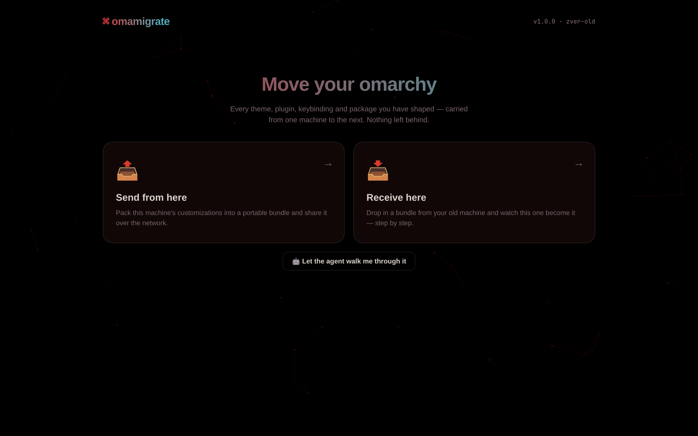
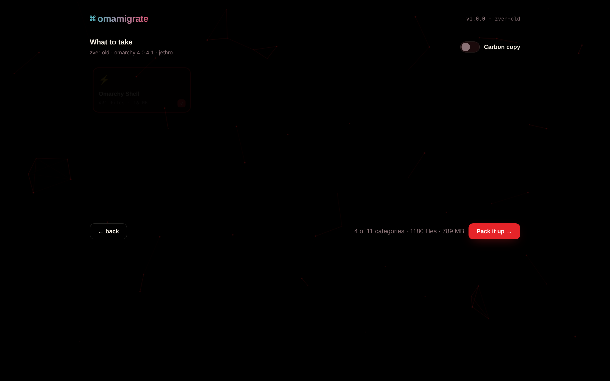
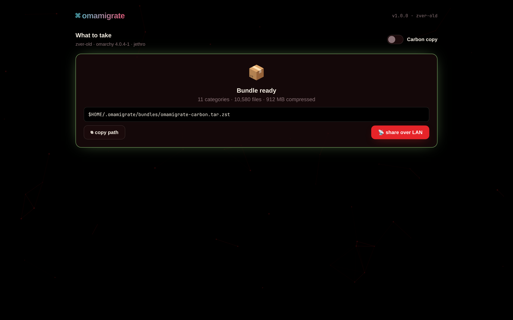
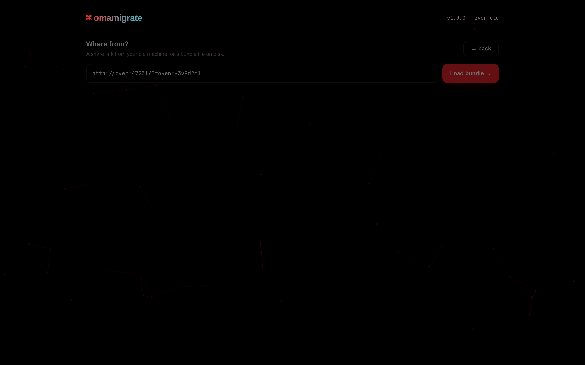
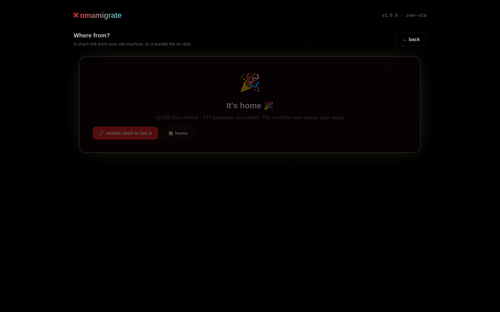

# omamigrate

**Your setup, on the new machine.**

You spent months getting Omarchy just right. The theme, the keybindings, the shell prompt that finally feels like yours. Got a new machine, or a new drive? omamigrate packs all of it into one file and puts it back where it belongs.



## What it does

omamigrate moves your whole Omarchy setup from one machine to another. It gathers your configs, themes, shell setup, terminal setups, editor and agent defaults, plugins, and the list of packages you have installed. All of that goes into one compressed file, called a bundle. Think of it as a moving box for your desktop. You open the box on the new machine, and everything goes back in its place.

## How it works

**Pack it on the old machine.** Open the dashboard and press "Send from here." It scans the machine and shows what it found as cards. Pick what you want, or take everything.



**Hand it over.** Press "share over LAN" and you get a one-line URL. The new machine loads the bundle straight from that link.



**Apply it on the new one.** Press "Receive here," paste the URL, and press Load. Try a dry run, then press "Apply to this machine." It backs up, restores, restarts, and checks its own work.





## Features

- **One file, whole setup.** A full setup is about 1 GB. One real example: 10,580 files and 177 packages, compressed to 912 MB.
- **Dresses to match.** The dashboard picks up the colors of your active Omarchy theme automatically.
- **Pick and choose.** 11 categories, each on its own card. Tick what you want, or flip "Carbon copy" to take everything.
- **Dry run first.** See what would happen before anything does. A dry run changes nothing.
- **Backups before changes.** Whatever it touches gets saved to `~/.omamigrate/backups/` first.
- **Checks its own work.** The verify step tells you exactly what landed.
- **A guide if you want one.** "Let the agent walk me through it" hands the job to a local AI coding agent that talks you through it.

## Installing

Pick whichever you like. All three put `omamigrate` on your PATH.

```sh
# 1. The Omarchy package (lands in the Omarchy repo — PR in review)
omarchy pkg add omamigrate

# 2. The install script (installs to ~/.local/bin, adds a menu entry, opens the dashboard)
curl -fsSL https://raw.githubusercontent.com/jethrojones/omamigrate/v1.0.0/install.sh | bash

# 3. Clone it
git clone https://github.com/jethrojones/omamigrate && cd omamigrate && ./install.sh

# 4. Build the Arch package (PKGBUILD ships in the repo)
git clone https://github.com/jethrojones/omamigrate && cd omamigrate/pkgbuild && makepkg -sf && sudo pacman -U omamigrate-*.pkg.tar.zst
```

## A guided tour

1. **Install it on both machines** (see above).
2. **Open the dashboard on the old machine.** Run `omamigrate gui`. Your browser opens a dark dashboard in your theme's colors, with two big buttons.
3. **Pack.** Press "Send from here." You'll see 11 cards: shell, Hyprland, themes, terminals, dev tools, packages, defaults, apps, share, plus SSH/secrets and personal files. Those last two stay out unless you opt in. Tick what you want, or flip "Carbon copy." omamigrate packs one compressed file.
4. **Share.** Press "share over LAN." Copy the one-line URL it prints.
5. **Load on the new machine.** Run `omamigrate gui`, press "Receive here," paste the URL (or point at a bundle file on disk), and press Load. You'll see what's inside: files, packages, plugins, themes.
6. **Dry run.** Preview the apply. You'll see what would happen. Nothing on the machine changes.
7. **Apply.** Press "Apply to this machine." You'll see 8 animated steps: backup, files, packages, plugins, themes, defaults, restart, verify.
8. **Restart.** Restart is built into the apply run. When verify finishes, it tells you exactly what landed. That's your old setup, on your new machine.

**If you'd rather be led:**

1. Run `omamigrate gui`.
2. Choose "Let the agent walk me through it."
3. Answer its questions. A local AI coding agent walks you through the whole thing in plain conversation. Good if the category names mean nothing to you yet. Nobody is born knowing what Hyprland is.

## Safety

Before omamigrate changes anything, it backs up what it touches to `~/.omamigrate/backups/`. A dry run is one click away and changes nothing. SSH keys, secrets, and personal files only go into a bundle if you explicitly opt in. The LAN share link carries a random token, so it isn't an address anyone can guess.

## From the terminal

Everything the dashboard does is also a plain command: `omamigrate scan`, `omamigrate pack`, `omamigrate unpack`, `omamigrate apply`, `omamigrate verify`, `omamigrate serve`, and `omamigrate gui`. If you live in a terminal, you can stay there.

---

New machine, same you. Welcome home.

## License

MIT — see [LICENSE](LICENSE).

<!-- Copy by Claude Opus 5.5. Assembled by opencode Qwen3.8-27B on 2026-09-28 08:25 PT on zver-old -->
